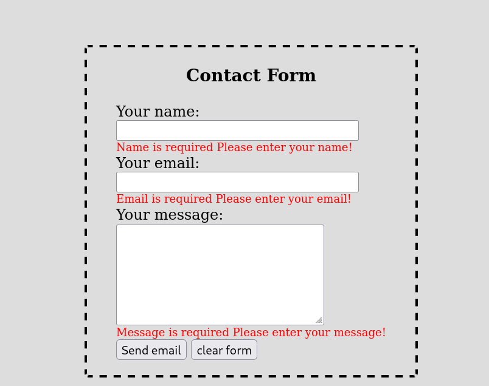
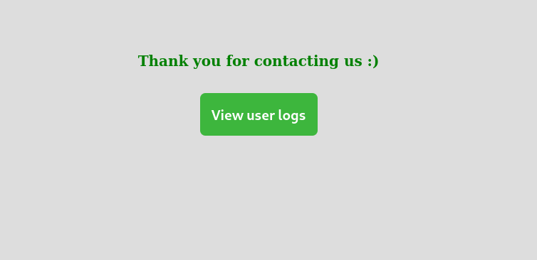
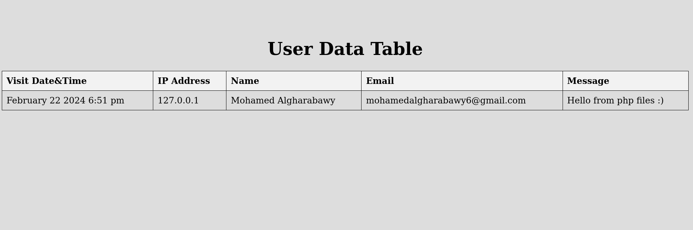

# Lab 2: Working with Files

This lab focuses on enhancing a contact form implemented in PHP by adding features to log user submissions and creating an interface to view the log data.

## Files Overview
- `index.php`: Contains the main contact form where users submit their information.
- `config.php`: Stores configurations such as max length and log file paths.
- `functions.php`: Includes functions for processing form submissions and logging data.
- `log_viewer.php`: Interface to view the log file data.

## Task Description
- **Log User Submissions**: Upon successful validation of the contact form, the script logs the visit date, visit time, user IP address, email, and name into a text log file.
- **Log File Interface**: An additional PHP file (`log_viewer.php`) is created to display the data stored in the log file in a tabular format.
  
## Implementation Details
- **Validation**: The contact form performs validations for name, email, and message length.
- **Logging**: Data is logged using the specified date format "F j Y g:i a".
- **Configuration**: All configurations, including max length and log file paths, are stored in `config.php`.
- **Interface**: The log file interface is styled to resemble the provided image.
  
## Instructions
1. Place all PHP files (`index.php`, `config.php`, `functions.php`, `log_viewer.php`) in the `Lab_2_PHP` folder.
2. Ensure PHP is configured correctly on your server or localhost.
3. Access the contact form by opening `index.php` in a web browser.
4. Submit valid information in the contact form to test the logging feature.
5. Use the `View User Logs` button in `index.php` to access the log viewer interface (`log_viewer.php`).
6. Review the log data displayed in the interface.

*Figure 1: Contact Form Interface*

*Figure 2: After Submition Interface*

*Figure 3: Log Viewer Interface*
