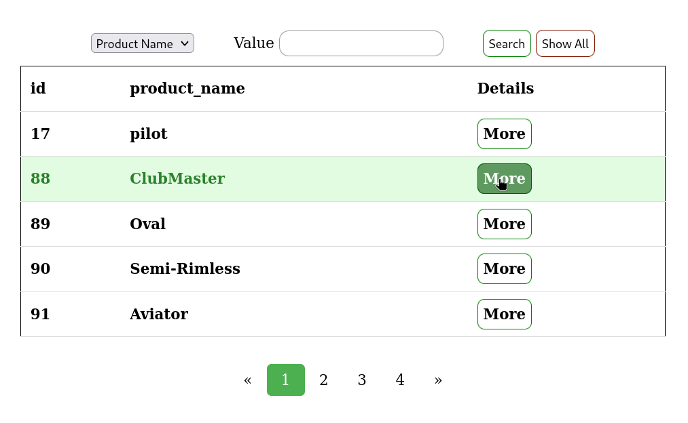
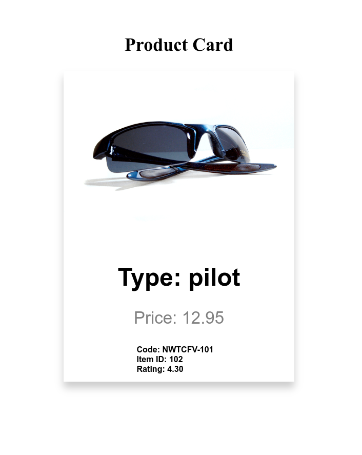
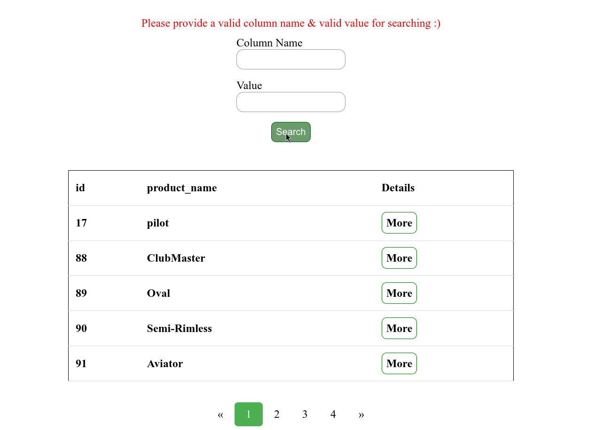

# PHP Task Working with MySQL

This PHP project is a simple web application for managing items. It includes features such as pagination and search functionality.
based on selecting items details from MYSQL Database.

## Description

The project consists of the following components:

- **index.php:** Main page displaying items with pagination.
- **details.php:** Page for displaying details of a specific item.
- **Model/MainProgram.php:** Main program containing database connection and item retrieval methods.
- **Model/items.php:** Model class representing items.
- **style.css:** Stylesheet for HTML pages.

## Sample Output Images

*Figure 1: Screenshot of the index.php page displaying items with pagination.*

*Figure 2: Screenshot of the details.php page displaying details of a specific item.*

## Sample Output Images

*Figure 3: Screenshot of the index.php page displaying search functionality validation.*

*Figure 4: Screenshot of the index.php page displaying searching for specific item.*