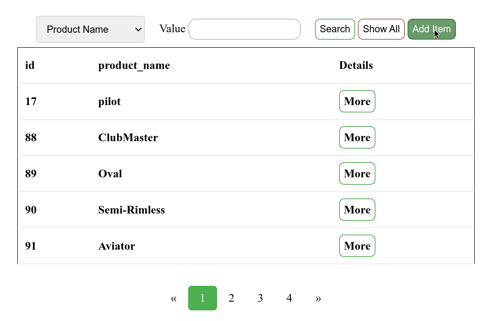
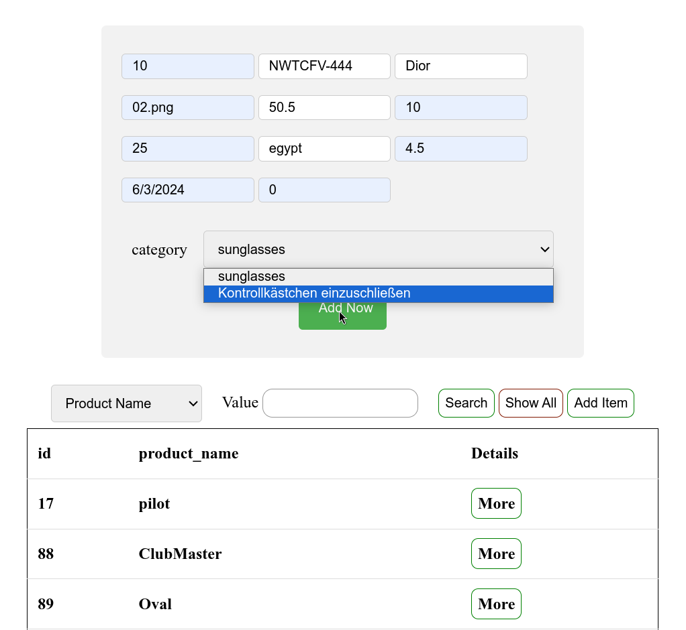
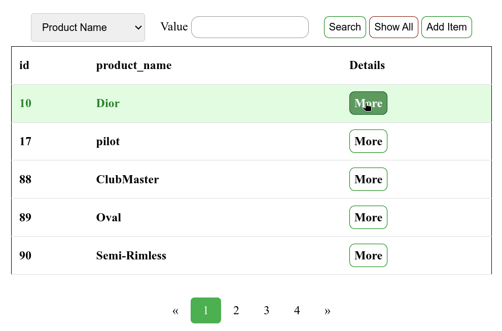
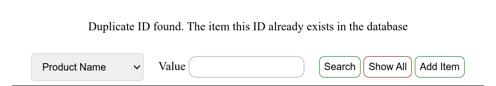
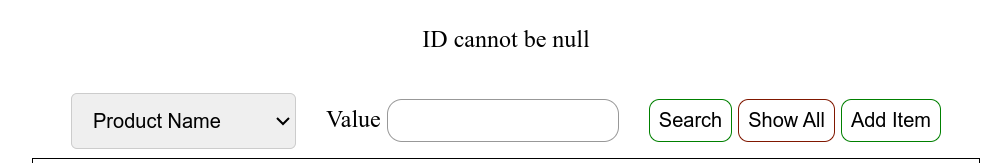

# PHP Task Working with MySQL

This PHP project is a simple web application for managing items. It includes features such as pagination and search functionality.
based on selecting items details from MYSQL Database.

## Description

The project consists of the following components:

- **index.php:** Main page displaying items with pagination.
- **details.php:** Page for displaying details of a specific item.
- **Model/MainProgram.php:** Main program containing database connection and item retrieval methods.
- **Model/items.php:** Model class representing items.
- **style.css:** Stylesheet for HTML pages.

## Additional feature Adding an Item

The application allows users to add new items to the database using the "Add Item" functionality. Here's how it works:

- **index.php:** Users can click on the "Add Item" button to access the add item form.

- **Add Item Form:** The form allows users to enter details of the new item, including ID, product code, product name, photo path, list price, reorder level, units in stock, country, rating, date, and discontinued status.

- **Validation:** The form performs validation to ensure that mandatory fields are not empty and that the ID provided is unique. If there are any validation errors, appropriate error messages are displayed.

- **Submitting the Form:** Upon submitting the form, the application processes the data and inserts the new item into the database.

## Sample Output Images

*Figure 1: Screenshot of the index.php page displaying items with pagination.*

*Figure 2: Screenshot of the details.php page displaying filling add item form data.*

*Figure 3: Screenshot of the index.php page displaying that the data added to the database successfuly.*

*Figure 3: Screenshot of the index.php page displaying the added item in the table.*

*Figure 4: Screenshot of the index.php page displaying the item details from database.*

*Figure 4: Screenshot of the index.php page displaying error message when the user tries to add already existed item.*

*Figure 4: Screenshot of the index.php page displaying validation and handling to make id not null.*